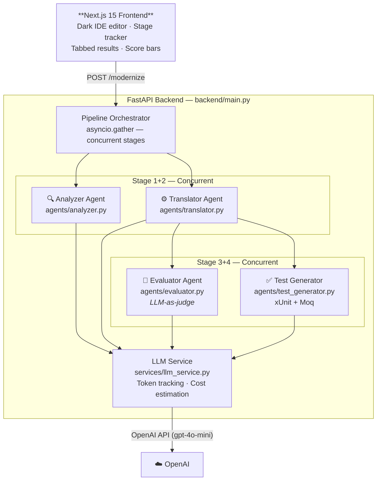

# P2C — AI-Powered Legacy Code Modernization


> **P2C** is a self-evaluating AI pipeline that transforms legacy PowerBuilder, COBOL, and VB6 into production-grade C# .NET 8 — with LLM-as-judge quality scoring, token cost tracking, real-time streaming, and auto-generated xUnit tests.

---

## The Problem

Legacy code modernization is one of the most expensive, error-prone, and under-tooled problems in enterprise software. Specifically:

- **Scale**: Billions of lines of PowerBuilder, COBOL, and VB6 are still running critical business systems globally
- **Lost knowledge**: Original developers are retired or gone; documentation is sparse or missing
- **Manual translation is risky**: Human translators make logic errors, miss edge cases, and can't scale
- **No feedback loop**: Traditional tools translate blindly — there's no automatic quality gate on the output
- **Test coverage is zero**: Migrated code arrives untested, creating regression risk

---

## The Solution

P2C is a **4-stage agentic pipeline** that doesn't just translate — it understands, translates, judges its own output, and generates verification tests. Each stage is powered by a purpose-built LLM agent with a specialized system prompt.

```
Legacy Code Input
      │
      ├──[concurrent]──► 🔍 Analyzer   → Business summary, complexity, constructs
      ├──[concurrent]──► ⚙️ Translator  → Idiomatic C# .NET 8 with XML docs
      │
      ├──[concurrent]──► 🧪 Evaluator  → Faithfulness (0–100), Idiomaticity (0–100), Risk level
      └──[concurrent]──► ✅ Tests       → xUnit + FluentAssertions + Moq test class
                │
                ▼
      Structured JSON response + SSE stream
```

---

## Architecture



**Key design decisions:**

| Decision | Impact |
|---|---|
| Stages 1+2 run concurrently | ~50% latency reduction |
| Stages 3+4 run concurrently | Evaluation doesn't block test generation |
| LLM-as-judge Evaluator | Self-grading pipeline — catches translation errors automatically |
| `complete_with_usage()` on every call | Token count + USD cost in every response |
| SSE `/stream-modernize` endpoint | Real-time stage-by-stage UI updates |
| `dotenv` auto-load at startup | Zero manual env setup after initial `.env` creation |

---

## Features

### 🔍 Analysis
- Plain-English business purpose summary
- Complexity rating: `low` / `medium` / `high`
- Key constructs identified (DataWindow, SQLCA, PFC services, etc.)
- Deep migration context built into every prompt (DataWindow → EF Core, SQLCA → SqlConnection)

### ⚙️ Translation
- Target: idiomatic **C# .NET 8** (records, pattern matching, LINQ, async/await)
- XML doc comments on every public member
- DataWindow → Entity Framework Core DbSet with `TODO` comments
- Embedded SQL → parameterised `IDbConnection` queries
- Namespace: `LegacyMigrated.<ModuleName>`

### 🧪 Evaluation (LLM-as-Judge)
- **Faithfulness Score** (0–100): Are all business rules preserved?
- **Idiomaticity Score** (0–100): Does the C# feel native to .NET 8?
- **Risk Level**: `Low` / `Medium` / `High`
- Strengths and issues list
- Reviewer note paragraph

### ✅ Test Generation
- Framework: **xUnit** with `[Fact]` and `[Theory]` attributes
- Assertions: **FluentAssertions** (`result.Should().Be(...)`)
- Mocking: **Moq** for all interfaces and external dependencies
- Naming: `MethodName_Scenario_ExpectedResult` convention
- Covers: happy path, null inputs, boundary values, expected exceptions
- Coverage notes included

### 📡 SSE Streaming
- `POST /stream-modernize` sends typed Server-Sent Events:  
  `status` → `analysis` → `translation` → `evaluation` → `tests` → `done`
- Frontend can update incrementally rather than waiting for the full response

### 💰 Cost Tracking
- Every response includes `usage`:
  - `prompt_tokens`, `completion_tokens`, `total_tokens`
  - `estimated_cost_usd` (aggregated across all 4 agent calls)

---

## Example

### Input (PowerBuilder)

```powerbuilder
function long f_get_salary(long al_emp_id) returns decimal
  decimal ldc_salary
  
  SELECT emp_salary
  INTO :ldc_salary
  FROM employees
  WHERE emp_id = :al_emp_id
  USING SQLCA;
  
  if SQLCA.SQLCode <> 0 then
    MessageBox("DB Error", SQLCA.SQLErrText)
    return -1
  end if
  
  return ldc_salary
end function
```

### Output

**Analysis:**
> Medium complexity. Retrieves an employee salary by ID using Embedded SQL via the SQLCA transaction object. Returns -1 on database error. Key constructs: Embedded SQL, SQLCA transaction object, typed return value.

**Translated C# (.NET 8):**
```csharp
namespace LegacyMigrated.Employees;

public class EmployeeService
{
    private readonly IDbConnection _connection;
    
    public EmployeeService(IDbConnection connection) =>
        _connection = connection;

    /// <summary>
    /// Retrieves the salary for the specified employee.
    /// </summary>
    /// <param name="employeeId">The unique employee identifier.</param>
    /// <returns>The employee's salary, or -1 if not found or on error.</returns>
    public async Task<decimal> GetSalaryAsync(long employeeId)
    {
        try
        {
            const string sql = "SELECT emp_salary FROM employees WHERE emp_id = @EmployeeId";
            var result = await _connection.QueryFirstOrDefaultAsync<decimal?>(sql,
                new { EmployeeId = employeeId });

            return result ?? -1m;
        }
        catch (Exception ex)
        {
            // TODO: Replace with structured logging (ILogger<EmployeeService>)
            throw new InvalidOperationException($"DB Error retrieving salary for employee {employeeId}", ex);
        }
    }
}
```

**Evaluation:**
| Metric | Score |
|---|---|
| Faithfulness | 94/100 |
| Idiomaticity | 91/100 |
| Risk Level | Low |

**Generated xUnit Tests:**
```csharp
namespace LegacyMigrated.Tests;

public class EmployeeServiceTests
{
    [Fact]
    public async Task GetSalaryAsync_ValidEmployee_ReturnsSalary()
    {
        // Arrange
        var mockConn = new Mock<IDbConnection>();
        // ... setup mock ...
        var sut = new EmployeeService(mockConn.Object);

        // Act
        var result = await sut.GetSalaryAsync(42);

        // Assert
        result.Should().Be(75000m);
    }

    [Fact]
    public async Task GetSalaryAsync_EmployeeNotFound_ReturnsNegativeOne()
    {
        // ...
    }
}
```

**Usage:**
```json
{
  "prompt_tokens": 1847,
  "completion_tokens": 923,
  "total_tokens": 2770,
  "estimated_cost_usd": 0.000831
}
```

---

## Project Structure

```
P2C/
├── backend/                          # Python / FastAPI backend
│   ├── .env                          # Your API key (create from .env.example)
│   ├── main.py                       # App entrypoint · pipeline · SSE endpoint
│   ├── agents/
│   │   ├── base.py                   # Abstract BaseAgent
│   │   ├── analyzer.py               # Stage 1: analysis
│   │   ├── translator.py             # Stage 2: C# translation
│   │   ├── evaluator.py              # Stage 3: LLM-as-judge ★
│   │   └── test_generator.py         # Stage 4: xUnit tests
│   ├── services/
│   │   └── llm_service.py            # OpenAI wrapper + token/cost tracking ★
│   ├── models/
│   │   └── schemas.py                # Pydantic v2 (EvaluationResult, UsageStats)
│   ├── utils/
│   │   └── prompts.py                # Deep PB/COBOL/VB6 migration context
│   └── tests/
│       └── test_pipeline.py          # Mocked smoke tests (no API credits used)
│
├── app/                              # Next.js 15 / TypeScript frontend
│   ├── layout.tsx                    # SEO metadata · Inter + JetBrains Mono
│   ├── globals.css                   # Dark IDE palette · animations
│   └── page.tsx                      # IDE editor · stage tracker · tabs · scores
│
├── postcss.config.mjs                # Tailwind v4 PostCSS plugin
├── .env.local                        # Frontend API URL
└── README.md
```

---

## How to Run

### Prerequisites
- Python 3.12+
- Node.js 18+
- An OpenAI API key

### 1 — Backend

```bash
# From project root
cp backend/.env.example backend/.env
# Edit backend/.env and set OPENAI_API_KEY=sk-...

python -m uvicorn backend.main:app --port 8000 --reload
```

Swagger UI: **http://localhost:8000/docs**

### 2 — Frontend

```bash
# From project root (one-time)
npm install

npm run dev   # → http://localhost:3000
```

### 3 — Run Tests (no API key needed)

```bash
cd backend
python -m pip install pytest httpx
python -m pytest tests/ -v
```

---

## Environment Variables

**`backend/.env`**

| Variable | Default | Description |
|---|---|---|
| `OPENAI_API_KEY` | *(required)* | Your OpenAI secret key |
| `OPENAI_MODEL` | `gpt-4o-mini` | `gpt-4o` for best quality |
| `ALLOWED_ORIGINS` | `*` | CORS origins (restrict in production) |

**`.env.local`** (frontend)

| Variable | Default | Description |
|---|---|---|
| `NEXT_PUBLIC_API_BASE_URL` | `http://localhost:8000` | Backend URL |

---

## API Reference

### `POST /modernize` — Full pipeline

```json
// Request
{
  "code": "event clicked()\n  ...\nend event",
  "source_language": "powerbuilder",
  "target_language": "csharp"
}

// Response
{
  "analysis": "...",
  "complexity": "medium",
  "key_components": ["DataWindow", "SQLCA"],
  "translated_code": "public async Task<decimal> GetSalaryAsync(...) { ... }",
  "translation_notes": "...",
  "test_cases": "[Fact] public async Task GetSalaryAsync_ValidEmployee...",
  "test_notes": "...",
  "evaluation": {
    "faithfulness_score": 94,
    "idiomaticity_score": 91,
    "risk_level": "Low",
    "strengths": ["Idiomatic async/await", "Proper parameterised SQL"],
    "issues": [],
    "reviewer_note": "Excellent translation with full business logic preservation."
  },
  "usage": {
    "prompt_tokens": 1847,
    "completion_tokens": 923,
    "total_tokens": 2770,
    "estimated_cost_usd": 0.000831
  }
}
```

### `POST /stream-modernize` — Real-time SSE

Emits typed events: `status` → `analysis` → `translation` → `evaluation` → `tests` → `done`

### Individual endpoints
- `POST /analyze` — Analysis only
- `POST /translate` — Translation only  
- `POST /generate-tests` — Tests only
- `GET /health` — Health check

---

## What Makes This Production-Grade

| Feature | Why It Matters |
|---|---|
| ✅ Concurrent agent execution (`asyncio.gather`) | Real engineering — not a sequential prompt chain |
| ✅ LLM-as-judge self-evaluation | Automatic quality gate on every translation |
| ✅ Token + cost tracking per request | Observability that ops teams need |
| ✅ SSE streaming | UX that real AI products ship |
| ✅ Pydantic v2 validation on all I/O | Production-grade schema enforcement |
| ✅ Smoke tests with mocked LLM | Zero-cost CI — runs without API key |
| ✅ Swappable LLM provider | Change `llm_service.py` to use Anthropic/Gemini/Ollama |
| ✅ Auto dotenv loading | No shell environment setup required |
| ✅ Deep migration context prompts | DataWindow→EF Core, SQLCA→SqlConnection, PFC→DI |

---

## Extending the Tool

| Goal | Where to change |
|---|---|
| Support a new legacy language | Add entry to `LANGUAGE_HINTS` in `utils/prompts.py` |
| Swap LLM provider | Rewrite `services/llm_service.py` only |
| Add a new pipeline stage | Create agent in `agents/`, add to `main.py` |
| Add authentication | FastAPI `Depends()` in `main.py` |
| Persist results to DB | Add SQLAlchemy model + Alembic migration |
| Deploy to cloud | `Dockerfile` + Vercel for frontend (already has `vercel.json`) |